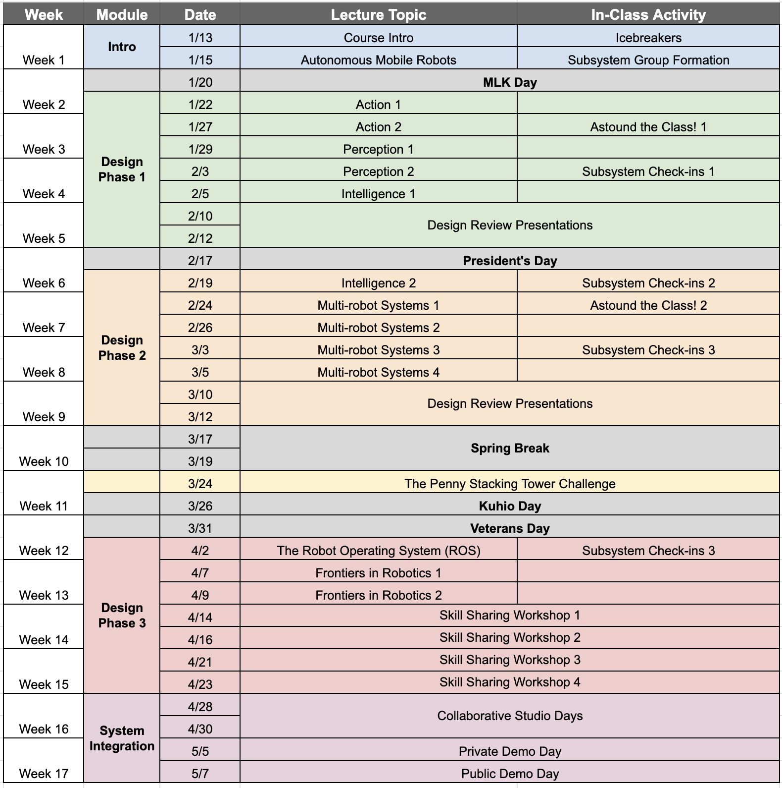

<link rel="stylesheet" type="text/css" href="assets/css/styles.css">

# ECE 693H: Multi-robot System Design
**Instructor:** Dr. Daniel Drew, Assistant Professor, Electrical Engineering\
**Course Meets:** Mo/We 3:30pm - 4:45pm, HOLM 242

**Course Summary:**\
This 3-credit course will cover fundamental concepts related to the sensing, actuation, signal processing, and control mechanisms underlying robots and other intelligent physical systems.   Robots and other connected devices with the ability to physically interact with the world around them are transforming the world. The study of these systems is inherently interdisciplinary, and working on them effectively requires both a broad skillset and the ability to think about end-to-end systems holistically. This course is divided into three overarching modules: sensing, actuation, and intelligence. Each module will contain detail about both the theoretical underpinnings and the practical implementation of the topic material. Every class will include hands-on experience with electronic components and an embedded microcontroller, building the requisite tools over the course of the semester for a final project where you will program an autonomous robot in a class competition.   Specific topics of study include: transduction principles of common sensors and actuators, basic circuits and principles for the interfacing of sensors and actuators with embedded microcontrollers, microcontroller architecture concepts, introductory-level digital signal processing including intelligent thresholding, low- and high-pass filters, introductory feedback control principles including PID, and machine learning concepts like neural networks. 

For more detailed information, please see [the course syllabus](readings/reading1/syllabus.md).

**Schedule:**\
This schedule is meant to serve as an outline and guide for the course. Please note that it may be modified throughout the semester as we see how things go. Any changes will be announced in class and posted here. 

## Readings

|              Topic                                                                 | Date |
| :-------                                                                           |:----:|
|[1. Syllabus](readings/reading1/syllabus.md)                                        | 1/13 |
|[2. Autonomous Mobile Robots ](readings/reading2/reading2.md)                       | 1/15 |

## Tasks

|              Topic                                                                 | Date |
| :-------                                                                           |:----:|
|[1. The FabLab](tasks/task1/task1.md)                                               | 1/13 - 1/17 |

## Slides

|              Topic                                                                 | Date |
| :-------                                                                           |:----:|
|[1. Course Intro](slides/pdfs/ece693h_1_courseintro.pdf)                            | 1/13 |

## Assignments

|              Name                                                                 | Due Date |
| :-------                                                                           |:----:|
|[1. Astound the Class 1](assignments/astoundtheclass/astoundtheclass1.md)           | 1/27 |

<!--
readings
|[2. Autonomous Mobile Robots ](slides/pdfs/ece693h_2_autonomousmobilerobots.pdf)    | 1/15 |

tasks
|[2. Fusion 360 - MCAD](tasks/task2/task2.md)                                        | 1/20 - 1/27 |
|[3. Fusion 360 - ECAD](readings/reading2/reading2.md)                               | 1/27 - 2/3 |
|[4. ROS2](readings/reading2/reading2.md)                                            | 2/3 - 2/10|
|[5. Git and Material for MkDocs](readings/reading2/reading2.md)                     | 2/10 - 2/17|
-->
