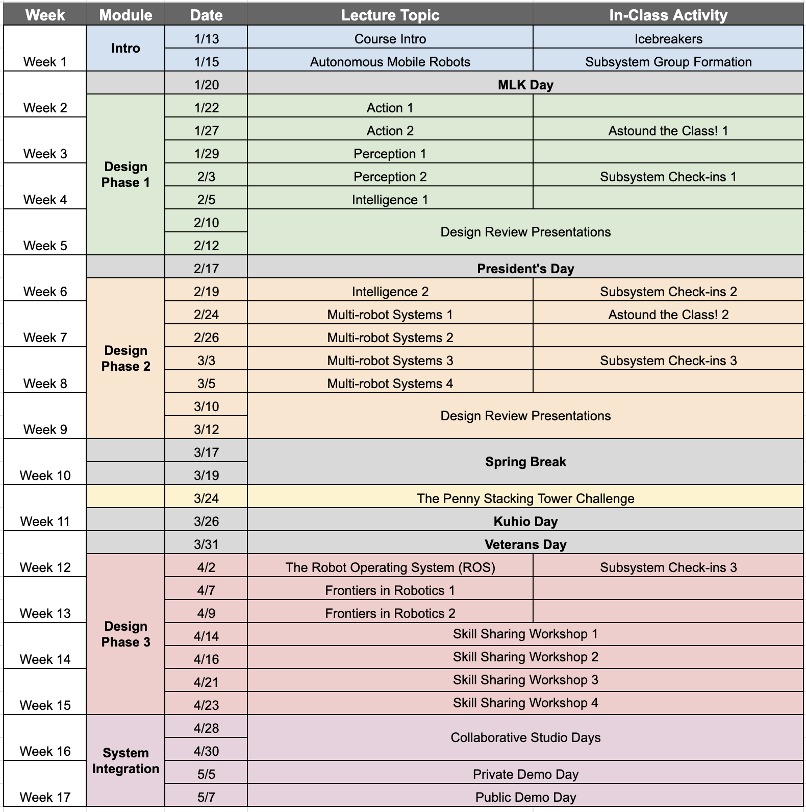

<link rel="stylesheet" type="text/css" href="../../assets/css/styles.css">

# ECE 693H: Syllabus

## Course Summary

| Overview |   |
| :----| :-----|
| **Course** | ECE 693H: Multi-robot System Design |
| **Department** | Electrical and Computer Engineering |
| **Instructor** | Dr. Daniel Drew |
| **Prerequisities** | Basic Python Basic Circuits Signal and Systems analysis |
| **Suggested Background** | At least one of: Embedded systems programming; solid modeling and rapid prototyping; feedback control; advanced Python programming; PCB design and layout
| **Credit Hours** | 3 |
| **Semester** | Spring 2025 |
| **Meets** | MoWe 3:30pm - 4:45pm, HOLM 242 |

## Description
In this fast-paced upper division course, we will work collaboratively to develop a swarm of small-scale robots from the ground up. Working largely in groups, you will design, prototype, and build robotic subsystems (e.g., power management, computation and communication, mobility, perception) which can be integrated into a single flexible platform. Using state-of-the-art robot simulation and coordination frameworks (Gazebo, ROS2), we will build several of these platforms and deploy them as a “swarm.”    You can expect a combination of traditional lectures to provide background on relevant topics and techniques, studio-based sessions with instructor-facilitated small group work, and student-run skill-sharing workshops and subsystem design reviews. Grading will be based largely on project group peer evaluations, in-class presentations, and a final technical report.    This course provides hands-on experience engineering end-to-end systems, with an emphasis on key skills for industry jobs: mechatronics, embedded systems, programming, advanced digital manufacturing, wireless communication, and more. You will also develop important “soft skills” for working as part of a modern engineering team, including project management, technical content delivery, and pedagogical methods.

## Goals and Objectives
There are no traditional problem sets or exams in this course; core learning objectives will be mastered through in-class exercises, hands-on cyberphysical system development, and the various presentation opportunities throughout the semester. 

By the end of this course, you will be able to:

**Hardware**
- Describe how a variety of sensors transduce physical quantities into electrical signals
- Describe how a variety of actuators transduce electrical signals into mechanical motion
- Describe the architecture of a modern microcontroller
- Build and use supporting circuits to safely drive electric motors
- Build and use supporting circuits to reliably gather sensor data

**Software**
- Use and understand complex software libraries
- Filter noisy sensor signals digitally
- Improve your understanding of Python for use in real-time systems

**Systems**
- Implement a closed feedback loop between a sensor and actuator connected through a microcontroller
- Understand the interplay between the timing of code and the timing of the physical world in the context of cyberphysical systems
- Describe what constitutes a robotic and cyberphysical system
- Describe the origin of robotics and cyberphysical systems as well as ongoing and future challenges

**Teamwork**
- Identify team roles and identify a feasible team performance plan
- Work effectively in teams to solve engineering challenges

## Communication
**Asynchronous questions:** The easiest way to contact your instructor directly is to the use the Email function in Laulima. You can also send questions directly via email. Please include the course number in the subject line. For example, "[ECE 693H] - Question about Lecture 2." 

**Office hours:** Dr. Drew's office hours are in Holmes 439 Wednesdays 2:00pm - 3:00pm, or by appointment.

## Course Schedule
This schedule is meant to serve as an outline and guide for the course. Please note that it may be modified throughout the semester as we see how things go. Any changes will be announced in class and posted here. 

## Evaluation and Grading
Your grade in this course will be based on two formal Design Reviews, a Skill-Sharing Workshop, an informal "Astound-the-Class" presentation, a final Technical Report, and a measure of your Class Participation. Class participation will be assessed through a combination of peer review, instructor evaluation during in-class exercises, and instructor-chosen opportunities to discuss key figures and concepts from the lectures and readings.

- **Design Reviews (40% of your grade):** Two formal small-group presentations documenting progress on your subsystem design efforts. Your grade will be assessed by a rubric, with categories including presentation visual and spoken clarity, technical write-up level of detail and reproducability, and Q&A preparedness. 
- **Skill-Sharing Workshop  (20% of your grade):** Towards the end of the semester, each subsystem group will have the opportunity to lead a full class period workshop combining lecture content and a hands-on exercise. 
- **Astound-the-Class Presentation (10% of your grade):** Short, informal presentations where you will discuss news, hot-off-the-press research results, or little known facts which tie in with the course content.  
- **Final Technical Report (20% of your grade):** Written in standard academic format and with a high bar for prose and image quality, the final Technical Report should stand as a lasting artifact of your efforts in the class. 
- **Class Participation (10% of your grade):** Your participation grade will be assessed by the instructor during each class period. Be prepared to answer questions about the reading assignments and to participate enthusiastically in any group work. 
- **Extra Credit:** There will be various opportunities in the course to receive extra credit. For example, you will have chances to provide (informal and formal) course feedback for extra credit.

<u><strong>There are no "typical" assignments and there will be no late work accepted in this course.</strong></u> Missing a presentation slot without a very good reason, or at least a long forewarning, could be catastrophic to your grade. 

## Grading Scale
Your final course grade will NOT be curved. My objective is to ensure that as many students learn the course material as possible. It is theoretically possible for every student to get an A or for every student to get an F. Grades will be based on the following distribution:\
≥93%: A\
≥83%: B\
≥73%: C\
≥65%: D\
<60%: F\
Grey areas between two letter grades (e.g., 90-93% --> A, A-) and +/- grades will be determined based on the following: 1) course attendance, 2) overall course participation, 3) upward/downward trend in course grades/participation, 4) final project performance, and 5) clear mastery of the learning objectives.

## Accomodations
Please work with the UH Manoa accomodations office [here](https://hawaii.edu/kokua/getting-started/on-campus-housing-accommodations.php). Please contact your instructor as soon as possible if an extreme personal circumstance (hospitalization, death of a close relative, natural disaster, etc.) is interfering with your ability to complete your work. Accommodations will be considered on an individual basis and may require documentation.